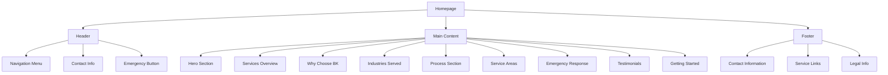
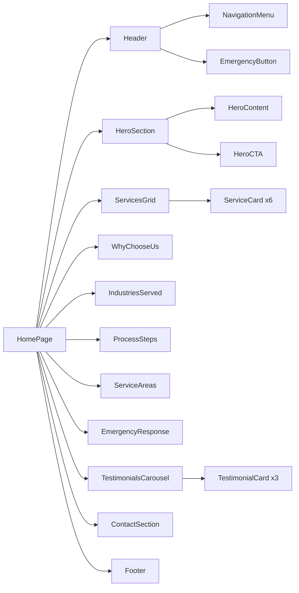
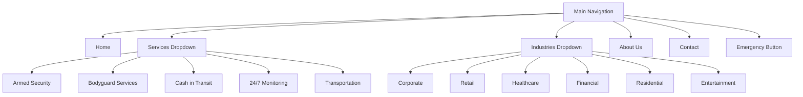
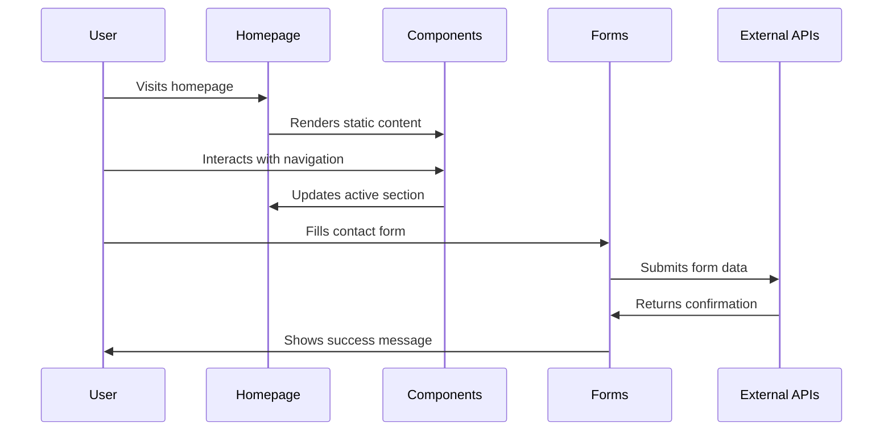
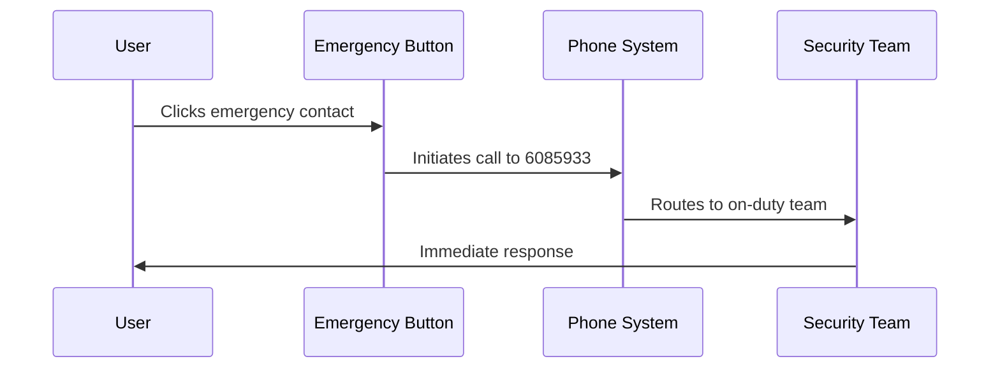
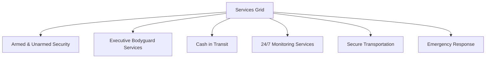
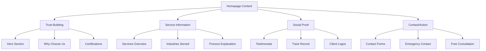
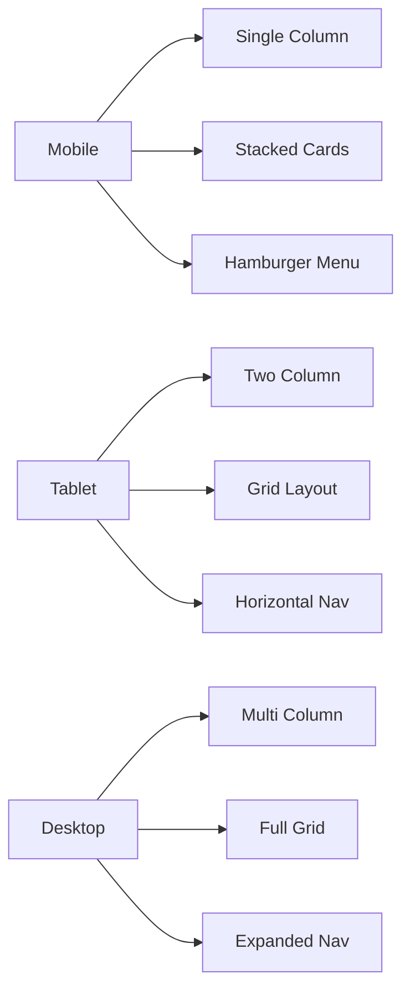

# BK Security Services Homepage Design

## Overview

This document outlines the design for BK Security Services homepage - a professional, clean, and modern website for a $500B security services company. The design emphasizes trust, professionalism, and comprehensive security solutions using a black, blue, and white color scheme.

## Technology Stack & Dependencies

### Frontend Framework
- **Next.js 15.5.2** with App Router architecture
- **React 19.1.0** for component composition
- **TypeScript 5** for type safety

### UI Framework & Styling
- **Tailwind CSS 4** for utility-first styling
- **shadcn/ui** component library with Radix UI primitives
- **Lucide React** for consistent iconography
- **next-themes** for dark mode support

### Available Components
- Navigation: `navigation-menu`, `menubar`, `dropdown-menu`
- Layout: `card`, `separator`, `tabs`, `accordion`
- Forms: `button`, `input`, `select`, `textarea`, `form`
- Display: `badge`, `avatar`, `progress`, `table`
- Feedback: `alert`, `dialog`, `toast` (sonner), `tooltip`
- Interactive: `carousel`, `collapsible`, `hover-card`

## Component Architecture

### Page Structure Hierarchy



### Component Definition

#### Header Component
- **Type**: Navigation container with sticky positioning
- **Components Used**: `navigation-menu`, `button`, `separator`
- **Features**: 
  - Logo placement
  - Main navigation items
  - Emergency contact button
  - Mobile responsive menu

#### Hero Section Component
- **Type**: Landing area with call-to-action
- **Components Used**: `card`, `button`, `badge`
- **Features**:
  - Large heading with value proposition
  - Descriptive text
  - Primary CTA buttons
  - Trust indicators (licensed, insured, 24/7)

#### Services Overview Component
- **Type**: Grid-based service showcase
- **Components Used**: `card`, `tabs`, `badge`
- **Features**:
  - Service cards with icons
  - Hover effects
  - Brief descriptions
  - Quick access to detailed info

#### Industries Component
- **Type**: Categorized industry display
- **Components Used**: `accordion`, `card`, `badge`
- **Features**:
  - Expandable sections per industry
  - Industry-specific security needs
  - Visual categorization

#### Process Component
- **Type**: Step-by-step visualization
- **Components Used**: `card`, `separator`, `progress`
- **Features**:
  - Numbered process steps
  - Progress indicators
  - Clear action items

#### Testimonials Component
- **Type**: Social proof display
- **Components Used**: `carousel`, `card`, `avatar`
- **Features**:
  - Rotating testimonials
  - Client avatars
  - Star ratings
  - Company attribution

#### Contact/CTA Component
- **Type**: Lead generation form
- **Components Used**: `form`, `input`, `button`, `alert`
- **Features**:
  - Contact form
  - Multiple contact methods
  - Emergency contact prominence

### Component Hierarchy & Props



### Props/State Management

#### Header Props
```typescript
interface HeaderProps {
  isScrolled: boolean;
  isMobileMenuOpen: boolean;
  emergencyNumber: string;
}
```

#### Service Card Props
```typescript
interface ServiceCardProps {
  title: string;
  description: string;
  icon: LucideIcon;
  features: string[];
  availability: string;
}
```

#### Testimonial Props
```typescript
interface TestimonialProps {
  name: string;
  role: string;
  company: string;
  content: string;
  rating: number;
  avatar?: string;
}
```

## Routing & Navigation

### Navigation Structure
- **Home** (current page)
- **Services** (dropdown with all service types)
- **Industries** (dropdown with industry categories)
- **About Us**
- **Contact**
- **Emergency** (prominent button)

### Navigation Menu Implementation


## Styling Strategy

### Color Scheme
```css
/* Primary Color Palette */
:root {
  --color-primary-blue: #1e40af;
  --color-primary-blue-dark: #1d4ed8;
  --color-primary-blue-light: #3b82f6;
  
  --color-neutral-black: #000000;
  --color-neutral-gray-900: #111827;
  --color-neutral-gray-800: #1f2937;
  --color-neutral-gray-100: #f3f4f6;
  --color-neutral-white: #ffffff;
  
  --color-accent-blue: #60a5fa;
  --color-success: #10b981;
  --color-warning: #f59e0b;
  --color-error: #ef4444;
}
```

### Typography Scale
- **Headings**: Geist Sans (--font-geist-sans)
- **Body Text**: Geist Sans
- **Code/Technical**: Geist Mono (--font-geist-mono)

### Design Tokens
- **Spacing**: Tailwind spacing scale (4px base unit)
- **Border Radius**: 4px, 8px, 12px, 16px
- **Shadow**: Tailwind shadow utilities
- **Transitions**: 200ms ease-in-out

### Component Styling Patterns

#### Card Variants
```typescript
const cardVariants = {
  default: "bg-white dark:bg-gray-900 border border-gray-200 dark:border-gray-800",
  elevated: "bg-white dark:bg-gray-900 shadow-lg border-0",
  primary: "bg-blue-600 text-white border-0",
  secondary: "bg-gray-100 dark:bg-gray-800 border-0"
}
```

#### Button Variants
```typescript
const buttonVariants = {
  primary: "bg-blue-600 hover:bg-blue-700 text-white",
  secondary: "bg-white hover:bg-gray-50 text-gray-900 border border-gray-300",
  emergency: "bg-red-600 hover:bg-red-700 text-white font-bold",
  outline: "border border-blue-600 text-blue-600 hover:bg-blue-50"
}
```

## State Management

### Client-Side State
- **Navigation State**: Mobile menu toggle, active section
- **Form State**: Contact form, consultation request
- **UI State**: Carousel position, accordion states
- **Theme State**: Dark/light mode preference

### State Management Approach
- **Local State**: React useState for component-specific state
- **Form State**: react-hook-form for form management
- **Theme State**: next-themes for theme persistence
- **URL State**: Next.js router for navigation state

### Key State Hooks

#### Mobile Navigation Hook
```typescript
const useNavigation = () => {
  const [isMobileMenuOpen, setIsMobileMenuOpen] = useState(false);
  const [activeSection, setActiveSection] = useState('home');
  
  return {
    isMobileMenuOpen,
    setIsMobileMenuOpen,
    activeSection,
    setActiveSection
  };
};
```

#### Contact Form Hook
```typescript
const useContactForm = () => {
  const form = useForm<ContactFormData>({
    resolver: zodResolver(contactSchema)
  });
  
  return {
    form,
    onSubmit: handleSubmit,
    isLoading,
    isSuccess
  };
};
```

## API Integration Layer

### Contact Form Integration
```typescript
interface ContactFormData {
  name: string;
  email: string;
  phone: string;
  service: string;
  message: string;
  urgency: 'normal' | 'urgent' | 'emergency';
}

const submitContactForm = async (data: ContactFormData) => {
  // Integration with form handling service
  // Could be Formspree, Netlify Forms, or custom API
};
```

### Emergency Contact Integration
```typescript
const emergencyContact = {
  phone: '6085933',
  email: 'secure4587@gmail.com',
  available: '24/7'
};
```

## Testing Strategy

### Component Testing
- **Unit Tests**: Jest + React Testing Library
- **Component Tests**: Test shadcn/ui component integration
- **Form Tests**: Validate form submission and validation
- **Accessibility Tests**: axe-core for a11y compliance

### Integration Testing
- **Navigation Tests**: Test menu interactions
- **Form Integration**: End-to-end form submission
- **Responsive Tests**: Cross-device compatibility
- **Performance Tests**: Page load and interaction metrics

### Testing Focus Areas
1. **Emergency Contact**: Ensure emergency button always works
2. **Form Validation**: All contact forms validate properly
3. **Mobile Navigation**: Menu works on all screen sizes
4. **Accessibility**: WCAG 2.1 AA compliance
5. **Performance**: Core Web Vitals optimization

## Data Flow Between Layers

### Homepage Data Flow


### Emergency Contact Flow


## Content Organization

### Page Sections Structure

#### 1. Hero Section
- **Primary Headline**: "Professional Security Services You Can Trust"
- **Secondary Headline**: "Protecting What Matters Most to You"
- **Description**: Trust-building paragraph with key benefits
- **CTAs**: "Call Now: 6085933" | "Get Free Consultation"
- **Trust Indicators**: Licensed, Insured, Bonded badges

#### 2. Services Overview (Grid Layout)


#### 3. Why Choose BK Security
- **Experienced Professionals**: Law enforcement & military backgrounds
- **24/7 Availability**: Round-the-clock response
- **Customized Solutions**: Tailored security plans
- **Proven Track Record**: Years of successful operations
- **Licensed & Insured**: Full certification compliance
- **Local Expertise**: Area knowledge & law enforcement relationships

#### 4. Industries Served (Accordion Format)
- Corporate & Executive Protection
- Retail & Commercial
- Healthcare & Medical
- Financial Institutions
- Residential Communities
- Entertainment & Events

#### 5. Process Steps (Timeline Format)
1. **Free Consultation**: Comprehensive security assessment
2. **Customized Security Plan**: Tailored solution development
3. **Professional Implementation**: Deployment with minimal disruption
4. **Ongoing Support & Monitoring**: Continuous service optimization

#### 6. Service Areas
- Metropolitan area coverage map
- Response time commitments
- Local presence benefits

#### 7. Emergency Response
- 24/7 emergency contact prominence
- Emergency situation types handled
- Response process outline

#### 8. Testimonials
- Client testimonials with roles/companies
- Star ratings
- Rotating carousel display

#### 9. Getting Started/Contact
- Multiple contact methods
- Free consultation offer
- Contact form
- Emergency contact emphasis

### Content Hierarchy



## Responsive Design Implementation

### Breakpoint Strategy
- **Mobile**: < 640px (sm)
- **Tablet**: 640px - 1024px (md/lg)
- **Desktop**: 1024px+ (xl/2xl)

### Layout Adaptations

#### Mobile Layout
- Single column layout
- Stacked navigation menu
- Simplified service cards
- Condensed testimonials
- Prominent emergency button

#### Tablet Layout
- Two-column service grid
- Horizontal navigation
- Expanded testimonial cards
- Side-by-side CTAs

#### Desktop Layout
- Multi-column layouts
- Full navigation menu
- Three-column service grid
- Hero section with sidebar
- Expanded testimonial carousel

### Component Responsive Behavior



## Performance Optimization

### Core Web Vitals Targets
- **LCP (Largest Contentful Paint)**: < 2.5s
- **FID (First Input Delay)**: < 100ms
- **CLS (Cumulative Layout Shift)**: < 0.1

### Optimization Strategies
- **Image Optimization**: Next.js Image component with proper sizing
- **Font Loading**: next/font with variable fonts
- **Component Lazy Loading**: React.lazy for below-fold components
- **Code Splitting**: Dynamic imports for heavy components
- **Caching**: Static generation where possible

### Asset Optimization
- **Images**: WebP format with fallbacks
- **Icons**: Lucide React for consistent iconography
- **Fonts**: Variable fonts (Geist) for optimal loading
- **CSS**: Tailwind CSS purging for minimal bundle size

## Security & Accessibility

### Security Measures
- **Form Validation**: Client and server-side validation
- **CSRF Protection**: Form tokens for submission security
- **Content Security Policy**: Strict CSP headers
- **Input Sanitization**: Prevent XSS attacks

### Accessibility Compliance (WCAG 2.1 AA)
- **Semantic HTML**: Proper heading hierarchy and landmarks
- **Keyboard Navigation**: Full keyboard accessibility
- **Screen Reader Support**: ARIA labels and descriptions
- **Color Contrast**: 4.5:1 minimum contrast ratio
- **Focus Management**: Clear focus indicators
- **Alternative Text**: Descriptive alt text for images

### Accessibility Features
```typescript
// Example accessibility implementations
const EmergencyButton = () => (
  <button
    aria-label="Call emergency security line: 6085933"
    className="bg-red-600 hover:bg-red-700 focus:ring-2 focus:ring-red-500"
  >
    Emergency: 6085933
  </button>
);
```

## Deployment Considerations

### Build Configuration
- **Next.js Static Export**: For CDN deployment
- **Image Optimization**: Configured for production CDN
- **Bundle Analysis**: Regular bundle size monitoring
- **Performance Monitoring**: Core Web Vitals tracking

### SEO Optimization
- **Meta Tags**: Comprehensive meta tag strategy
- **Structured Data**: JSON-LD for business information
- **Open Graph**: Social media sharing optimization
- **Sitemap**: XML sitemap generation
- **Robots.txt**: Search engine crawler guidance

### Production Checklist
- [ ] All emergency contact numbers functional
- [ ] Contact forms properly validated
- [ ] Mobile responsiveness verified
- [ ] Accessibility compliance tested
- [ ] Performance benchmarks met
- [ ] SEO optimization complete
- [ ] Security headers configured
- [ ] Analytics tracking implemented